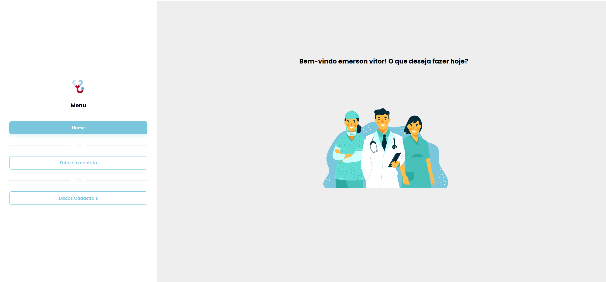
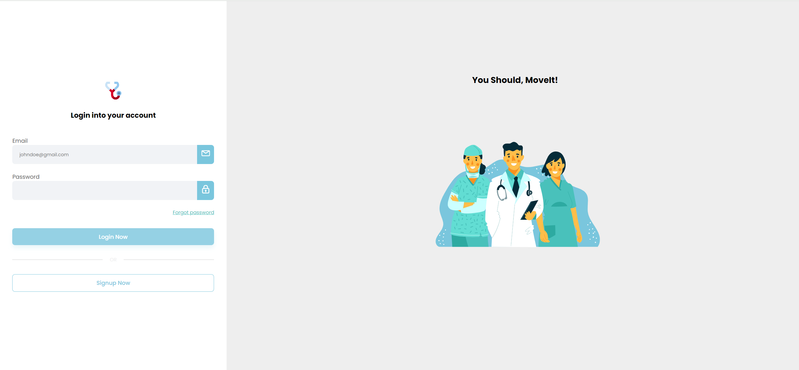

# ERP Hospitalar

Este projeto é um ERP para Hospitais, desenvolvido como parte de um desafio. O ERP é modular, e o módulo de cadastro de usuários foi implementado seguindo critérios específicos.

## Tecnologias Utilizadas

- **Front-end:** Angular
- **Back-end:** ASP.NET Core

## Funcionalidades

### Cadastro de Usuários
- Validação de CPF
- Nome do usuário com no mínimo 4 caracteres, contendo apenas letras e espaços
- Validação de e-mail
- Validação de telefone com DDD
- Cadastro de senha com letras maiúsculas, minúsculas e caracteres especiais

### Outras Funcionalidades
- Edição de cadastros existentes
- Login
- Dashboard com mensagem de boas-vindas
- Menu com opções de Login, Home e Entre em Contato
- Ação de alterar dados cadastrais


## Estrutura do Projeto

- **Back-end (ASP.NET Core):** Branch `dotnet`
- **Front-end (Angular):** Branch `angular`

## Instalação e Uso

### Clonando o Repositório

Para clonar e rodar o projeto, siga os passos abaixo.

#### Back-end

```bash
git clone https://github.com/Emerson-Vitor/erp-hospitalar.git --branch dotnet --single-branch
cd erp-hospitalar
# Abra o projeto no Visual Studio e configure conforme necessário
# Rode a aplicação
```

#### Front-end

```bash
git clone https://github.com/Emerson-Vitor/erp-hospitalar.git --branch angular --single-branch
cd erp-hospitalar
cd FrontEndApp
npm install
ng serve
```

## Imagens do Projeto

### Dashboard



### Tela de Login



## Autenticação

Este projeto utiliza JWT (JSON Web Token) para autenticação e AuthGuard no Angular para proteger as rotas.

